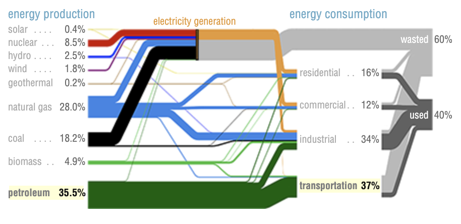

## Domain of Interest - **Climate Change**
We are interested in **Climate Change** because of its relevance to the world of today and tomorrow. How we choose to act against it will have major impact on the enviornment of the future as such, we are interested in how we can best utilize data to visualize its impacts and potential solutions.

Below we list a few examples of previous data driven projects relevant to **Climate Change**:

- [Comprehensive overview of climate change and the impact of technology](http://worrydream.com/ClimateChange/)
    - Their GitHub page can be found [here](https://github.com/worrydream/ClimateChange). It gives a decently in-depth overview of current funding within the United States, and the impacts of different energy sources. Furthermore, it provides different languages and techologies to model our climate and how different changes can worsen or benefit it. It also includes a lot of interesting visualizations that we could learn from, an example of a nice visualization is shown below:
    - 
- [source 2](link 2) - brief description
- [source 3](link 3) - brief description

Based on our knowledge of **Climate Change** and the projects mentioned above, we propose the following questions:

- How is climate change impacting the ***economy*** of different countries, are there factors that make some countries more susceptible to having a larger carbon footprint?
    - By looking at both economy and climate data with a country by year dataset, we can overlay changes in economy and changes in climate, perhaps via a map with color map based on income/GDP and climate change factors. We can then examine the correlation between each variable from both an economy and climate dataset to examine what specific factors correlate the best with each other. This will allow us to see how the worsening climate impacts the global economy, if a positive relationship is found (worse climate correlate with worse economy) we can raise the stakes in the climate change discussion.
- How are ***natural disasters*** impacting or being impacted by climate change, how have their natural patterns/fluctuations change in accordance to the change in global environment?
    - We know that climate change is impacting the world, but exactly how and what it is doing is not particularly clear. As such we hope to integrate multiple datasets that cover different natural disasters, their frequency, and their impact and correlate that with climate change factors, such as change in temperature and sea level to examine possible correlation.
- What are the ***trackable by-products*** of climate change (e.g. CO2 emissions) and what factors correlate to such, as in are there risk factors involved?
    - By finding specific empirical measurments that correlate the best with climate change, we can hint at possible causual relationships and find better ways to empircally determine the level of climate change. We hope to examine the many measurments done on a country that could potentially impact the enviornment (e.g. CO2 emissions, energy production, etc.) and correlate that with the impacts of climate change, such as change in temp, to see which of these factors measured could be a potential risk factor (i.e. more negatively impact climate change).

## Finding Data
To help us to better understand this domain and answer the questions in the previous section we found the following datasets:

- [**Temperature data with various scales**](https://www.kaggle.com/berkeleyearth/climate-change-earth-surface-temperature-data)
    - This dataset is from kaggle, although the original raw data was gathered from [Berkely Earth data](http://berkeleyearth.org/data/). All of the datasets from this source are stored in `data/kaggle_global_temp`, except for *GlobalLandTemperaturesByCity.csv* as it is around ~500 MB so we can not upload it to our GitHub since it is over the 50 MB upload size limit. In addition, we do not plan on using it as there is a smaller alternative, *GlobalLandTemperaturesByMajorCity.csv*, that provides similar data without the issue of a massive file size.
    - The source consists of four datasets (excluding *GlobalLandTemperaturesByCity.csv*):
        - Global Land and Ocean-and-Land Temperatures *(GlobalTemperatures.csv)*
            - Provides temperature measurments from 1750 onward for average land temperature and 1850 onward for average land + water temperature resulting in a total of **3192 values**
            - Consists of **9 columns**:
                - **dt** - date of measurment
                - **LandAverageTemperature** - global average land temperature in celsius
                - **LandAverageTemperatureUncertainty** - the 95% confidence interval around the average
                - **LandMaxTemperature** - global average maximum land temperature in celsius
                - **LandMaxTemperatureUncertainty** - the 95% confidence interval around the maximum land temperature
                - **LandMinTemperature** - global average minimum land temperature in celsius
                - **LandMinTemperatureUncertainty** - the 95% confidence interval around the minimum land temperature
                - **LandAndOceanAverageTemperature** - global average land and ocean temperature in celsius
                - **LandAndOceanAverageTemperatureUncertainty** - the 95% confidence interval around the global average land and ocean temperature
        - Global Average Land Temperature by Country *(GlobalLandTemperaturesByCountry.csv)*
        - Global Average Land Temperature by State *(GlobalLandTemperaturesByState.csv)*
        - Global Land Temperatures By Major City *(GlobalLandTemperaturesByMajorCity.csv)*
        - Global Land Temperatures By City *(GlobalLandTemperaturesByCity.csv)*
- [dataset 2](https://www.kaggle.com/dataenergy/natural-disaster-data#number-of-natural-disaster-events.csv)
- dataset 3
   - There are 728 values and 

